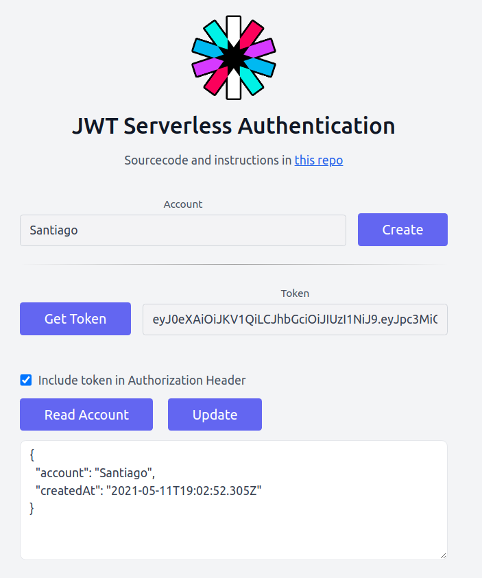

# JWT Serverless Authentication
<a href="https://github.com/s4nt14go/jwt-front">
  
</a><br /><br />

This is a demo about how you can authenticate your endpoints using JSON Web Tokens (JWT) with API Gateway.

These are the deployed endpoints:
- `/create-account` (public) Fill in a name and create an account
- `/get-token` (public) Get the token needed for the account you entered
- `/read-account` (authenticated) Get the account data
- `/update-account` (authenticated) Update the account data

<br />

For all the authenticated endpoints we have to include a valid token in the request.
>NOTE: They expire after 5m, so it should be a recent one

The token is generated by `get-token`, there we sign it with a secret stored in the backend. The requests that require authentication (`/read-account` and `/update-account`) will fail if the token isn't signed with that same secret (or has expired).

Check what you get when reading or updating the account data while checking/unchecking "Include token in Authorization Header" option.

# Demo

[Click here](https://jwt-s4nt14go.netlify.app) to check the demo!

<br />
<p align="center">
    <a href="https://jwt-s4nt14go.netlify.app">
        
    </a>
</p>
<br />

### Techs used in this frontend
* React, TypeScript
* Tailwind CSS
* CI/CD: Netlify

# Backend

In [this repo](https://github.com/s4nt14go/jwt-back) you can take a look at the backend

# Instructions

1. After deploying the backend, you'll get the api url. So, to run React locally you'll have to set it through an environment variable. In the [config.ts](src/config.ts) we expect to work with `dev` and `prod` backend stages, as an example let's say we want to run the app against the `prod` stage, create an `.env` file with these env vars:

    ```dotenv
    REACT_APP_STAGE=prod
    REACT_APP_prod_API_URL=https://<your backend prod data>.execute-api.us-east-1.amazonaws.com/prod
    ```

1. Install dependencies

    ```shell script
    npm ci
    ```

1. Use Node 14 version, using [nvm](https://github.com/nvm-sh/nvm) you can:

    ```
    # set Node 14 in current terminal
    nvm use 14
    # set Node 14 as default (new terminals will use 14)
    nvm alias default 14
    ```

1. Install dependencies

    ```shell script
    npm ci
    ```
   
1. Run locally

    ```shell script
    npm start
    ```